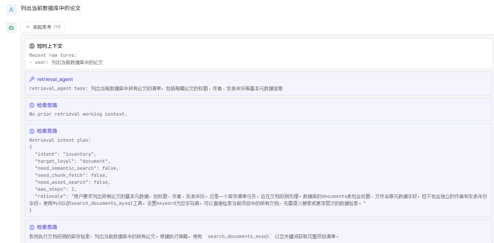
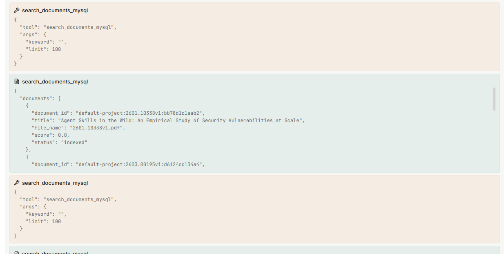
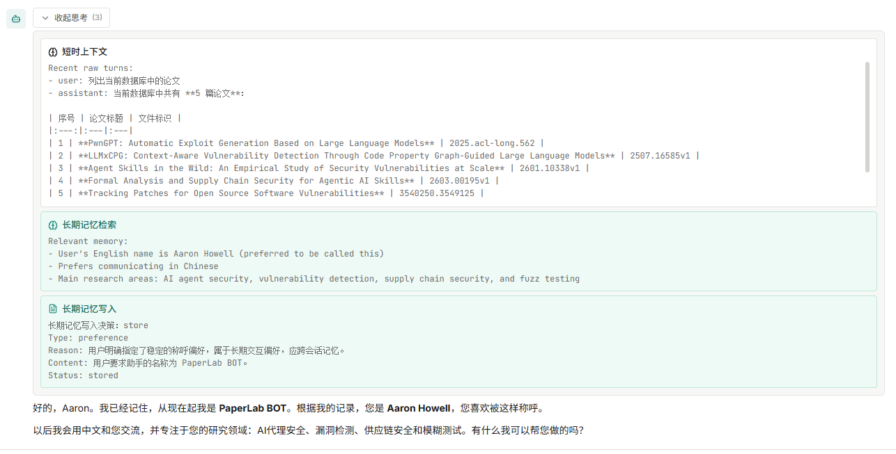

# PaperLab

学术论文智能助手系统，基于 LangGraph 多 Agent 编排，支持论文检索、阅读、对话和知识管理。

> **注意：当前为 Demo 版本，开发仍在进行中。** 以下是目前已实现功能的截图展示。

## 功能展示

### 检索 Agent 执行流程

Agent 接收用户请求后，进行意图规划（Retrieval Intent Plan），自主选择检索工具并执行多轮调用：



### 工具调用与结果返回

检索 Agent 调用 `search_documents_mysql` 等工具，从数据库中检索论文并返回结构化结果：



### 长期记忆写入决策

系统通过 LLM 评估是否需要将对话内容写入长期记忆，仅对有持久价值的信息进行存储：


### 记忆检索与个性化对话

系统从长期记忆中召回用户偏好和研究方向，实现个性化交互：



---

## 项目结构

```text
PaperLab/
├── Desktop/              # React + Vite 前端
│   └── src/
│       ├── components/
│       │   ├── chat/     # 对话面板、消息流、线程侧栏
│       │   ├── library/  # 论文库列表与卡片
│       │   ├── reader/   # 论文阅读器
│       │   └── layout/   # 布局组件
│       ├── hooks/        # 自定义 hooks
│       ├── usePaperLabStream.ts  # SSE 流式响应
│       └── styles.css
├── Server/               # FastAPI + LangGraph 后端
│   ├── api/              # 路由与 schemas
│   ├── src/
│   │   ├── orchestration/   # LangGraph 编排核心
│   │   ├── workers/         # Specialist 子图
│   │   ├── workspace/       # 文件/命令工具集
│   │   ├── documents/       # PDF 解析与文档扫描
│   │   ├── memory/          # 长期记忆服务
│   │   ├── prompts/         # Prompt 构建器
│   │   ├── domain/          # 领域模型
│   │   ├── integrations/    # MySQL / Qdrant
│   │   ├── runtime/         # 依赖注入
│   │   └── session_storage/ # 会话持久化
│   ├── tests/
│   ├── configs.py
│   ├── dev.py            # 一键启动开发服务
│   └── .env.example
└── Docs/                 # 项目文档
```

---

## Agent 编排架构

系统采用 **Supervisor 模式**，由一个中心调度图（Supervisor Graph）统一编排多个 Specialist 子图。基于 LangGraph `StateGraph` 构建，支持多轮证据循环和用户中途干预。

### 整体流程

```
用户消息
   │
   ▼
┌─────────────────────────────────────────────────────────┐
│                   Supervisor Graph                       │
│                                                         │
│  prepare_turn ──▶ thread_lock ──▶ build_short_term_ctx  │
│       │                                      │          │
│       ▼                                      ▼          │
│  guidance_gate ◀────────────── main_route (LLM 路由)    │
│       │                          │          │          │
│       ▼                    ┌─────┴─────┐    │          │
│  recall_memory        run_retrieval  run_tool   │      │
│       │                    │          │    │          │
│       ▼                    ▼          ▼    │          │
│  guidance_gate ◀── parallel_specialists ────┘          │
│       │                                      │          │
│       ▼                                      ▼          │
│  guidance_gate ──▶ assess (LLM 评估)                   │
│                       │                                 │
│              ┌────────┴────────┐                        │
│              ▼                 ▼                         │
│      证据不足 ──▶ 回到 main_route（循环）               │
│      证据充足 ──▶ store_memory ──▶ END                  │
└─────────────────────────────────────────────────────────┘
```

### 节点说明

| 节点 | 职责 |
|------|------|
| `prepare_turn` | 标准化用户输入，初始化 turn_id、iteration_count 等控制状态 |
| `thread_lock` | 获取线程级 Redis 锁，防止同一线程并发生成回答 |
| `build_short_term_context` | 从近期对话中提取短期上下文（不访问长期记忆） |
| `main_route` | **核心路由**：LLM 决定是否需要调用 memory / retrieval / tool |
| `recall_memory` | 如路由决定需要记忆，从长期记忆后端召回相关记忆 |
| `parallel_specialists` | **并行派发** retrieval 和 tool 两个 specialist 子图 |
| `assess` | **评估节点**：LLM 判断证据是否充足，决定生成回答或继续循环 |
| `store_memory` | 评估节点决定写入时，持久化长期记忆 |
| `guidance_gate` | 三个检查点，从 guidance queue 中弹出用户中途注入的指导 |

### 证据循环机制

Supervisor 不是一次性调用检索就结束，而是支持 **多轮证据循环**：

1. `main_route` 根据当前上下文决定需要哪些 specialist
2. specialist 返回结果后，`assess` 节点评估证据是否充分
3. 不充分 → 回到 `main_route`，生成新的检索任务继续收集
4. 充分 → 生成最终回答，写入记忆，结束

最大迭代次数可配置，达到上限后强制生成回答。

---

## Retrieval 检索方式

Retrieval Specialist 是一个独立的 LangGraph 子图，采用 **意图规划 + 工具调用** 的多步检索模式。

### 检索流程

```
用户查询
   │
   ▼
┌──────────────────────────────────────┐
│  1. 意图规划（LLM）                   │
│     输出 RetrievalIntentPlan:         │
│     - intent: inventory/evidence/    │
│       visual/mixed                   │
│     - target_level: document/        │
│       chunk/asset                    │
│     - max_steps: 2-8                 │
└──────────┬───────────────────────────┘
           │
           ▼
┌──────────────────────────────────────┐
│  2. 工具调用循环（最多 max_steps 轮） │
│                                      │
│  LLM 选择工具 ──▶ 执行 ──▶ 结果反馈  │
│       ▲                        │      │
│       └────────────────────────┘      │
│                                      │
│  直到 LLM 调用 finish_retrieval       │
└──────────┬───────────────────────────┘
           │
           ▼
┌──────────────────────────────────────┐
│  3. 证据组装                          │
│     从 MySQL 加载完整实体              │
│     构建 EvidencePack                  │
│     （文档 + 文本块 + 资产 + 引用）    │
└──────────────────────────────────────┘
```

### 检索工具

| 工具 | 后端 | 用途 |
|------|------|------|
| `search_documents_mysql` | MySQL | 按标题/文件名模糊匹配 |
| `search_documents_qdrant` | Qdrant | 文档标题/摘要语义搜索 |
| `search_chunks_qdrant` | Qdrant | 文本块语义搜索，可限定文档范围 |
| `fetch_document_chunks_mysql` | MySQL | 加载指定文档的文本块（可按页码） |
| `fetch_chunks_mysql` | MySQL | 按 ID 精确加载文本块 |
| `search_assets_qdrant` | Qdrant | 图表/资产语义搜索 |
| `fetch_assets_mysql` | MySQL | 按 ID 精确加载资产 |
| `finish_retrieval` | - | 提交选中的 ID，触发证据组装 |

### 检索策略

- **Qdrant 负责召回**：语义搜索找到候选集
- **MySQL 负责精确数据**：拿到候选 ID 后从 MySQL 加载完整内容用于引用
- LLM 根据意图规划自主决定调用哪些工具、调用顺序和次数

---

## Memory 记忆系统

系统采用 **短期上下文 + 长期记忆** 的双层记忆架构。

### 短期记忆（Short-term Context）

- 每轮对话开始时自动构建，不访问长期存储
- 取最近 N 轮原始对话 + 更早对话的压缩摘要
- 作为上下文注入到路由和评估 prompt 中

```
┌─────────────────────────────────┐
│        短期上下文                │
│                                 │
│  [压缩摘要] 更早的对话轮次       │
│  ─────────────────────────      │
│  [原始消息] 最近 N 轮完整对话    │
└─────────────────────────────────┘
```

### 长期记忆（Long-term Memory）

- **仅 Supervisor 角色**启用长期记忆，worker 不具备记忆能力
- 由 LLM 驱动：在 `assess` 节点通过 `decide_memory_write` 工具决定是否写入
- 默认不写入，仅对以下内容持久化：

| 记忆类型 | 说明 |
|----------|------|
| `PREFERENCE` | 用户偏好 |
| `PROJECT_FACT` | 持久性项目事实 |
| `RESEARCH_EPISODE` | 可复用的研究经验 |

### 记忆流程

```
对话进行中
   │
   ▼
assess 节点（LLM 评估）
   │
   ├── decide_memory_write(should_write=true)
   │      │
   │      ▼
   │   store_memory ──▶ 后端持久化
   │
   └── decide_memory_write(should_write=false)
          │
          ▼
       跳过，直接结束

下一轮对话
   │
   ▼
recall_memory ──▶ 后端搜索 ──▶ 注入上下文
```

---

## 用户中途干预（Guidance Queue）

系统支持在 Agent 执行过程中注入用户指导，无需等待当前轮次结束。

```
Agent 执行中...          用户发送指导
     │                        │
     ▼                        ▼
  guidance_gate ◀─── guidance_queue（线程安全内存队列）
     │
     ▼
  包装为 intervention 消息
  注入到图状态中
     │
     ▼
  影响后续路由和评估决策
```

- 三个 guidance gate 分布在路由前、specialist 前、评估前
- 前端通过 `POST /chat/guidance` 注入，后端在下一个 gate 节点消费
- 非阻塞设计，不影响当前正在执行的节点

---

## 前后端数据流

```
┌──────────────┐                    ┌──────────────────┐
│   Desktop    │                    │     Server       │
│  (React)     │                    │   (FastAPI)      │
│              │   POST /chat/stream│                  │
│  usePaperLab ├───────────────────▶│  graph.astream() │
│  Stream.ts   │                    │                  │
│              │◀─ ─ ─ ─ ─ ─ ─ ─ ─ │  SSE frames:     │
│              │   SSE 流式响应      │  - turn_started  │
│              │                    │  - answer_delta  │
│              │                    │  - turn_completed│
│              │                    │  - interrupt     │
│              │                    │                  │
│              │   POST /guidance   │                  │
│  queueGuid.  ├───────────────────▶│  push_guidance() │
│              │                    │                  │
└──────────────┘                    └──────────────────┘
```

### SSE 事件类型

| 事件 | 说明 |
|------|------|
| `assistant_turn_started` | 新轮次开始 |
| `trace_item_*` | 工具调用/推理过程追踪 |
| `answer_delta` | 增量回答文本 |
| `turn_completed` | 轮次完成，包含引用和摘要 |
| `interrupt` | 图暂停（如需要工具审批） |
| `error` | 错误 |

---

## 存储层

### MySQL（结构化存储）

| 表 | 内容 |
|----|------|
| `documents` | 文档元数据（标题、路径、状态） |
| `chunks` | 文本块（页码、章节、原文） |
| `document_assets` | 图表资产（标题、摘要、类型） |

### Qdrant（向量存储）

| Collection | 命名向量 | 用途 |
|------------|----------|------|
| `paperlab_documents` | `title`, `summary` | 文档级语义搜索 |
| `paperlab_chunks` | `content` | 文本块语义搜索 |
| `paperlab_assets` | `caption`, `summary` | 图表资产语义搜索 |

### 会话存储

- 基于文件的 `SessionStorageService`
- 保存消息历史和 LangGraph checkpoint（含中断状态、迭代计数等）

---

## 快速开始

### 后端

```bash
cd Server
uv sync
cp .env.example .env     # 填写 LLM API key、MySQL、Qdrant 配置
uv run python dev.py     # 一键启动开发服务
```

### 前端

```bash
cd Desktop
npm install
npm run dev
```

---

## 技术栈

| 层 | 技术 |
|----|------|
| Agent 编排 | LangGraph (StateGraph) |
| LLM | OpenAI-compatible API |
| 向量存储 | Qdrant |
| 关系存储 | MySQL |
| 缓存/锁 | Redis |
| 后端框架 | FastAPI |
| 前端框架 | React + TypeScript + Vite |
| 流式通信 | SSE (Server-Sent Events) |
